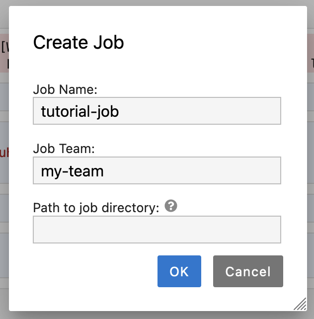
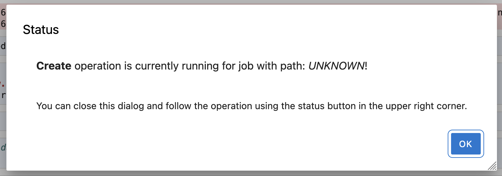
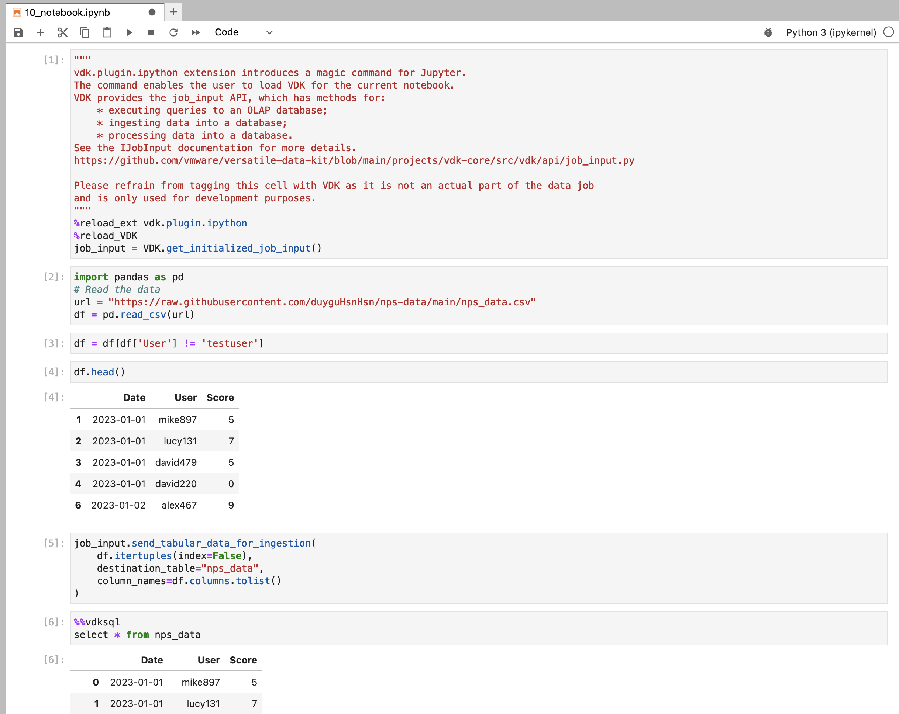
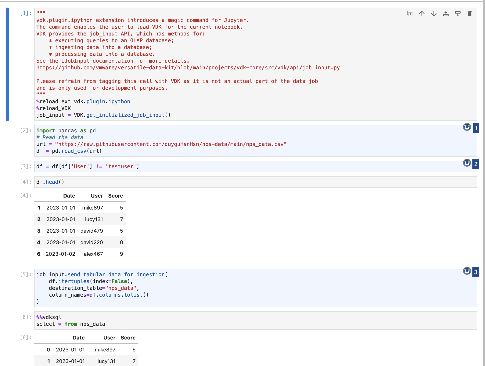
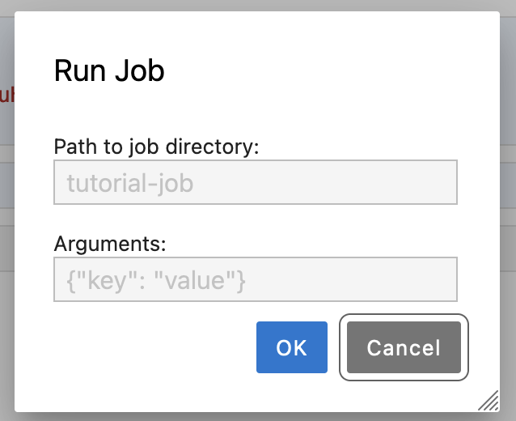
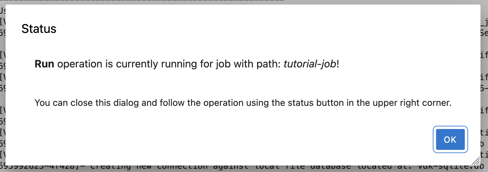
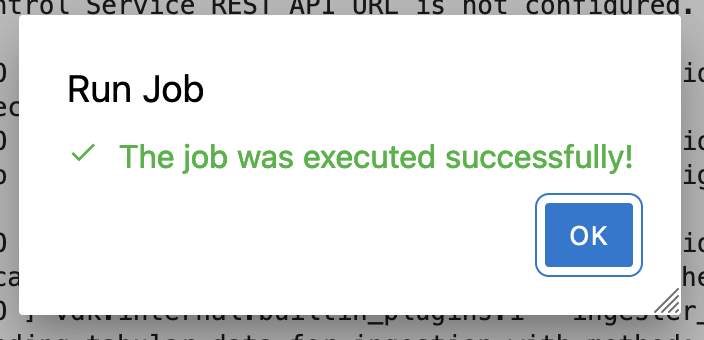

# Learn How to Convert a VDK Job with .sql and .py Steps into a Job with Notebook Steps using VDK Jupyter Notebook UI

Time Commitment: About 25-30 minutes.

## Prerequisites

Before you start with the conversion, please ensure you have the following:

<details>
  <summary><b>Installed Software and Services</b></summary>

- **VDK:** Ensure that the Versatile Data Kit is installed and properly configured.
- **[Control Service](https://github.com/vmware/versatile-data-kit/wiki/Interfaces#control-service:~:text=Parameterized%20SQL-,Control%20Service,-Job%20Lifecycle%20API):** Essential for orchestrating the execution of Data Jobs.
- **Jupyter instance:** Needed to access Jupyter Notebooks.
- **[vdk-jupyterlab-extension](https://github.com/vmware/versatile-data-kit/blob/main/projects/vdk-plugins/vdk-jupyter/vdk-jupyterlab-extension/README.md):** This extension integrates VDK with JupyterLab.
- **[vdk-notebook](https://github.com/vmware/versatile-data-kit/blob/main/projects/vdk-plugins/vdk-notebook/README.md):** Allows the execution of VDK jobs with notebooks.
- **[vdk-ipython](https://github.com/vmware/versatile-data-kit/blob/main/projects/vdk-plugins/vdk-ipython/README.md):** Loads VDK functionalities into IPython environments, allowing enhanced interaction.

</details>

Make sure to have all prerequisites in place to avoid any disruptions during the data job creation and build process.

## Data Job Creation Guide

### 0. Locate the 'Create' Option

- Select 'Create' option from the `VDK` section in the menu at the top.


### 1. Specify Job Properties

- **Initiate Creation Process:** Click 'Create' to open a dialog box.
- **Input Job Details:** Fill in the job name and job team as appropriate.
- **Specify Job Path:**
    - If no path is specified, the job will be created in the root directory.
    - To specify a path, input the relative Jupyter path to the job directory, using the `parent/child/job` pattern.
- **Submit:** Once all details are filled in, click 'OK' to continue.
    - The creation works both locally and in the cloud (if available).
    - Without cloud integration, the job will only be created locally.



### 2. Await Operation Status Update

- Wait for a status update on the job creation operation.



### 3. Successful Creation

- Once the creation operation is complete, a dialog box will inform you of the operation's result.


- Navigate to the data job directory to view your newly created job.


## Data Job Build Guide

This guide provides a general framework, and the provided example may not work with a specific database.
Adapt the queries to align with the database you are using.
Ensure that you configure the database properties in the `config.ini` file if they haven’t been set up already.

### Step 0: Explore the Auto-Created Sample Data Job

Familiarize yourself with the sample Data Job, focusing on its structure and components.
First read the included README.md and then open the included `.ipynb` notebook file to view detailed information and instructions.

<details>
  <summary><b>Explore Sample Data Job Structure</b></summary>

- Upon opening the file, observe cells containing sample information and instructional docstrings.
- **Configuration Cell:** Identify and run the configuration cell for VDK IPython as instructed, allowing VDK interaction within the notebook.
- **VDK Cells Examples:** Note two provided VDK cells illustrating basic usage and functionality.

  

</details>

<details>
  <summary><b>Learn More about Notebook Steps</b></summary>

#### Python Cells
Within the notebook, VDK provides an object — `job_input`, which has methods for:
- Executing queries
- Ingesting data
- Handling properties, and more.

To learn more about it, type `help(job_input)` in a Python cell.

#### SQL Cells
SQL-only cells can be created by starting the cell with `%%vdksql` magic. Properties and arguments within SQL cells are automatically replaced, for example `{db}`.

```ipython
%%vdksql
select * from {db}.sales
join {db}.marketing
using (sale_id)
```
</details>

<details>
  <summary><b>Execution Order and Identifying Cells</b></summary>

#### Tagging Cells with "vdk"
Cells can be tagged with "vdk". While this tag does not impact the development phase of the data job, it is crucial for subsequent automated operations, like a "VDK Run".

- **Impact of Tagging:** Only the cells critical to the data job should be tagged with "vdk". These tagged cells are essential during deployment and other execution processes.
- **Identifying VDK Cells:** They can be easily recognized by their unique color scheme, the presence of the VDK logo, and an exclusive numbering system.
- **Execution Order:** VDK cells in the notebook are executed according to their numbering when executing the notebook data job with VDK.
- **Untagged Cells:** Cells not tagged with "vdk" will be overlooked during deployment. They can be deleted as they are not essential to the data job's execution. However, removing VDK-tagged cells will alter the data job execution.

#### Sample Job Overview
In the sample job, there are two VDK cells, with the remaining ones being untagged.


</details>

### Step 1: Start Writing Your Data Job: A Step-by-Step Guide

In this guide, we will walk you through creating your first Data Job using the Jupyter UI. This Data Job will entail reading CSV data, transforming it, and subsequently ingesting it into your database.

#### **Dataset:**
We will be working with the following CSV dataset: [nps_data.csv](https://raw.githubusercontent.com/duyguHsnHsn/nps-data/main/nps_data.csv)

#### **Preliminary Setup:**
1. **Open the Sample Job** in the Jupyter UI.
2. **Remove the Two VDK Cells** from the sample job. Be cautious to retain the configuration cell.

#### **Development Steps:**
Our Data Job development will encompass five crucial steps. We will be adding separate cells for each step in the notebook and running each cell upon the completion of every step.

<details>
  <summary><i>Step 1: Load the Data</i></summary>

In the first step, we will load the data from the provided CSV link as a DataFrame.

```
import pandas as pd
# Read the data
url = "https://raw.githubusercontent.com/duyguHsnHsn/nps-data/main/nps_data.csv"
df = pd.read_csv(url)
```

</details>

<details>
  <summary><i>Step 2: Clean the Data</i></summary>

Next, we will remove any dirty test data from the DataFrame to clean our dataset.

```
df = df[df['User'] != 'testuser']
```

</details>

<details>
  <summary><i>Step 3: Inspect the Data</i></summary>
Post-cleaning, we will inspect the first few rows of our DataFrame to ensure the data is in the correct format and has been cleaned properly.

```
df.head()
```

</details>

<details>
  <summary><i>Step 4: Ingest the Data</i></summary>

Once satisfied with the cleanliness and structure of our data, we will ingest it using VDK's job_input.
In this step, additional parameters like collector_id can also be added if needed.

```
job_input.send_tabular_data_for_ingestion(
    df.itertuples(index=False),
    destination_table="nps_data",
    column_names=df.columns.tolist()
)
```

</details>

<details>
  <summary><i>Step 5: Validate the Ingestion</i></summary>

Finally, to ensure the success of our Data Job, we will validate whether the data has been ingested successfully by querying our destination table and inspecting the ingested data.

```
%%vdksql
select * from nps_data
```

</details>

<details>
  <summary><i>Final Layout</i></summary>

Upon completion of all the steps, your notebook should resemble the following:



</details>


###  Step 2: Tagging VDK Cells

Once you've written the code, let's look at it and see which steps are really needed to do the job.

The `df.head()` cell and the last select statement are not needed for our job.
What we want is to get the data, change it, and put it in - this is done by the rest of the code we have.
So, we’ll tag those important cells with VDK and leave the `df.head()` cell and the last select statement untagged.



<details>
  <summary><b>Why do we tag cells?</b></summary>

Tagging the right cells with VDK makes sure that when we do "VDK Run" or when the job runs on a schedule, no extra code runs.
You can either delete the extra cells or leave them untagged.
For this guide, we’ll leave them untagged so you can see the difference between tagged and untagged cells.

Now, with everything clear, let’s run the job!
</details>

Now that we know which code VDK needs to run, let’s actually run the job.


### Step 3: Let's Run the Job!

- Navigate to the menu bar at the top and select the Run option from the VDK section.


- Fill the inputs in the dialog box (we will only fill the job path since we will not be running with arguments)
- The operation by default works with your current working directory, so if you are located in your data job u might omit filling the path input.
- Otherwise, to specify a path, input the relative Jupyter path to the job directory, using the `parent/child/job` pattern.



- After you are done with filling the information, click the "Ok" button.
- You will get a dialog with the status of the operation.



- Additionally, you can track the time the operation takes by the status button in the upper right corner.


- After the operation is ready, you will get a dialog showing the result of the operation.



- To view detailed logs of the VDK run, refer to the `vdk-run.log` file. This file will open automatically, providing insights into the run process.
- You can find this log file in the root Jupyter directory.


## Wrap-up:
Congratulations!
You’ve now successfully developed your first Data Job!
This guide showcased a simple example, and you can explore more complex transformations and ingests in future jobs.
Keep experimenting and refining your skills!


## What's Next?

You are now familiar with the process of building and creating a data job consisting of notebook steps using the Jupyter UI.
It’s exciting to see how various .sql and .py steps can be seamlessly integrated into notebook steps, enabling a versatile and interactive development experience.

Explore further with the [VDK Examples list](https://github.com/vmware/versatile-data-kit/wiki/Examples).
