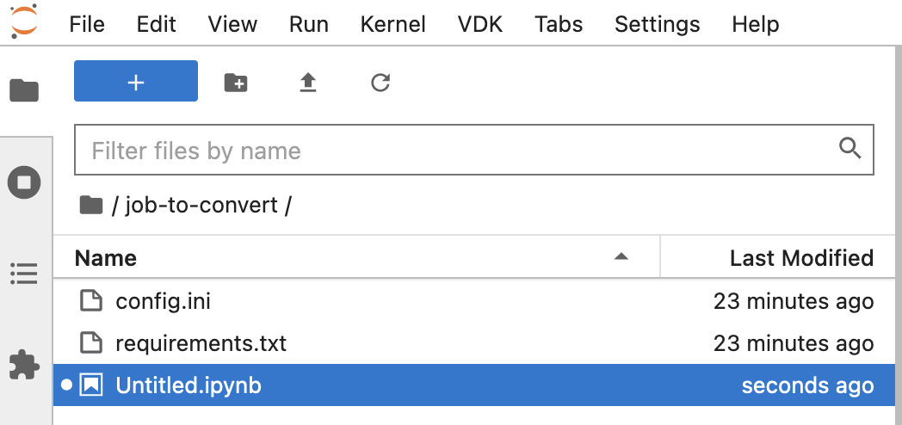
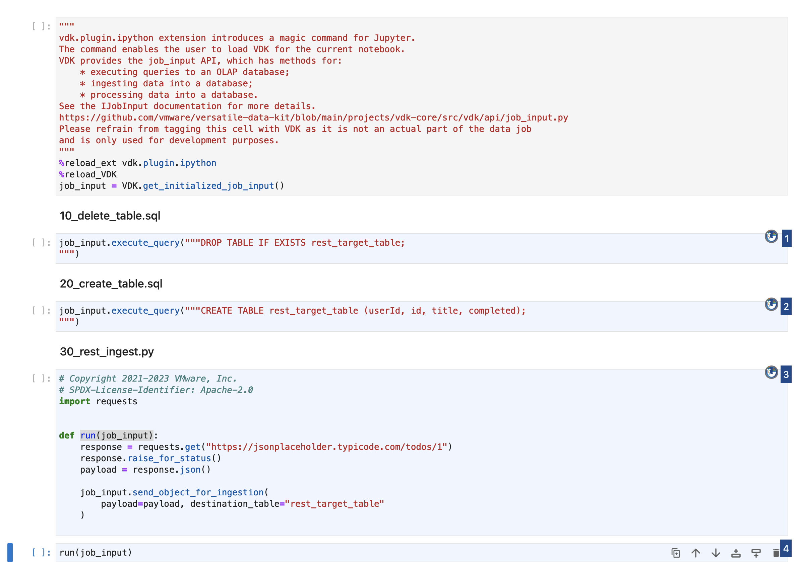

Learn how to convert a VDK Job with .sql and .py steps into a Job with notebook steps using VDK Jupyter Notebook UI.
Time Commitment: About 5-10 minutes.

## Prerequisites
* Installed VDK, Control Service, Jupyter instance, vdk-jupyterlab-extension, vdk-notebook, vdk-ipython
* Created and developed a VDK Data Job

## Data Job Conversion Guide

This guide presumes that you have already initialized a job either locally or in the cloud and have subsequently
downloaded it to your local file system.

### 0. [Optional] Get Familiar With Your Data Job
- **Navigate to the data job directory.**
- Familiarize yourself with the VDK steps and the file structure of the Data Job.

  

### 1. [Optional] Validate Your Data Job's Functionality
- From the menu bar at the top, locate the `VDK` section and choose the `Run` option.
- Remember the result since, after the conversion is completed, the job is expected to return the same result.

  

### 2. Locate the 'Convert Job To Notebook' Option
- Select 'Convert Job To Notebook' from the `VDK` section in the menu at the top.

  

### 3. Specify the Job Directory Path
- After clicking 'Convert Job To Notebook', a dialog will appear requesting the path to the job directory.
- If you are in the data job directory, this will be autofilled, and you can skip this step.
- Otherwise, populate the input with the relative Jupyter path to the job directory,
  following this pattern: `parent/child/job`.
- After filling the requested, click OK to continue.

  

### 4. Approve The Conversion

### 5. Await An Update On Operation's Status

### 6. Successful Conversion
- After the conversion operation is ready, you will receive a dialog with an update on the operation's result.

  

### 7. Examine The New Data Job Structure
- Post-conversion, the .sql and .py steps will be replaced with a notebook (.ipynb file).
- The file will be untitled, allowing you to rename it as you prefer.

  

- The notebook will feature a Guide explaining the transformations applied to your Data Job.
- Ensure you familiarize yourself with it. It will be located at the top of the notebook.
- After familiarizing yourself with it, you have the option to delete it.

  

- Review the new notebook steps.

  

### 8. [Optional] Confirm The Functionality Of Your Data Job Post-Conversion
- Navigate to the menu bar at the top and select the `Run` option from the `VDK` section.

  

- If you have completed step 1, verify whether the results align.
- Should discrepancies arise, please revisit and manually assess each step for potential issues.
- If reverting to the previous version is desired,
it will be saved in an archive within the parent directory of the job.

## What's Next?

You should now be acquainted with the process of converting a job consisting of .sql and .py steps into a job consisting of notebook steps through the Jupyter UI.

Explore further with the [VDK Examples list](https://github.com/vmware/versatile-data-kit/wiki/Examples).

If you're curious about the mechanics of the job conversion process, check
[VDK Jupyter Integration Convert Job Operation](https://github.com/vmware/versatile-data-kit/wiki/VDK-Jupyter-Integration-Convert-Job-Operation).
