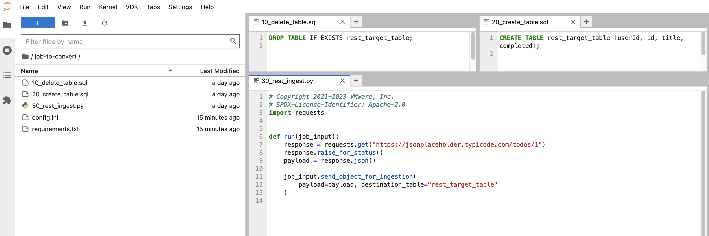
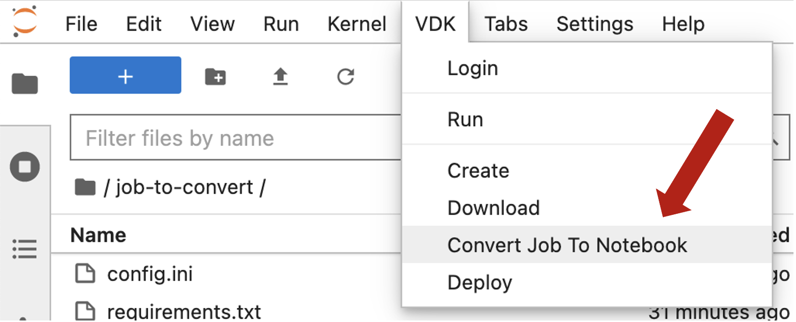

# Learn How to Convert a VDK Job with .sql and .py Steps into a Job with Notebook Steps using VDK Jupyter Notebook UI

Time Commitment: About 5-10 minutes.

## Prerequisites

Before you start with the conversion, please ensure you have the following:

  
<b>Installed Software and Services</b>

- **VDK:** Ensure that the Versatile Data Kit is installed and properly configured.
- **[Control Service](https://github.com/vmware/versatile-data-kit/wiki/Interfaces#control-service:~:text=Parameterized%20SQL-,Control%20Service,-Job%20Lifecycle%20API):** Essential for orchestrating the execution of Data Jobs.
- **Jupyter instance:** Needed to access Jupyter Notebooks.
- **[vdk-jupyterlab-extension](https://github.com/vmware/versatile-data-kit/blob/main/projects/vdk-plugins/vdk-jupyter/vdk-jupyterlab-extension/README.md):** This extension integrates VDK with JupyterLab.
- **[vdk-notebook](https://github.com/vmware/versatile-data-kit/blob/main/projects/vdk-plugins/vdk-notebook/README.md):** Allows the execution of VDK jobs with notebooks.
- **[vdk-ipython](https://github.com/vmware/versatile-data-kit/blob/main/projects/vdk-plugins/vdk-ipython/README.md):** Loads VDK functionalities into IPython environments, allowing enhanced interaction.

  
<b>Developed Data Job</b>

- Ensure that you have created and developed a VDK Data Job ready for conversion.

Make sure to have all prerequisites in place to avoid any disruptions during the conversion process.

## Data Job Conversion Guide

This guide presumes that you have already initialized a job either locally or in the cloud and have subsequently downloaded it to your local file system.

### 0. [Optional] Initial Review and Validation of Data Job

  
<b>Understand Your Data Job’s Contents</b>

- Navigate to the data job directory to understand the structure and contents better.
- Familiarizing yourself with the VDK steps and the file structure of the Data Job can provide insights into the job’s workflow and help in troubleshooting if needed later.

  
<b>Tip: Verify Data Job Before Conversion</b>

- Before converting, run the Data Job from the `VDK` section in the menu bar to validate its current functionality. This will help you confirm the conversion's success by comparing the results before and after the conversion.
- Take note of the result. Post-conversion, the job should yield the same result, serving as a validation point.

### 1. Locate the 'Convert Job To Notebook' Option

- Select 'Convert Job To Notebook' from the `VDK` section in the menu at the top.

### 2. Specify the Job Directory Path

- After clicking 'Convert Job To Notebook', a dialog will appear requesting the path to the job directory.
- If you are in the data job directory, this will be autofilled, and you can skip this step.
- Otherwise, populate the input with the relative Jupyter path to the job directory, following this pattern: `parent/child/job`.
- After filling the requested, click OK to continue.

### 3. Approve The Conversion

### 4. Await An Update On Operation's Status

### 5. Successful Conversion

- After the conversion operation is ready, you will receive a dialog with an update on the operation's result.

### 6. Examine The New Data Job Structure

  
<b>Review The Converted Notebook</b>

- Post-conversion, the .sql and .py steps will be replaced with a notebook (.ipynb file).
- The file will be untitled, allowing you to rename it as you prefer.

  
<b>Familiarize Yourself with the Conversion Guide</b>

- The notebook will feature a Guide explaining the transformations applied to your Data Job.
- Ensure you familiarize yourself with it. It will be located at the top of the notebook.
- After familiarizing yourself with it, you have the option to delete it.

  
<b>Inspect the New Notebook Steps</b>

- Review the new notebook steps to ensure that everything has been converted correctly.

  
<b>Tip: Confirm The Functionality Of Your Data Job Post-Conversion</b>

- Navigate to the menu bar at the top and select the `Run` option from the `VDK` section.

- If you have completed step 0, verify whether the results align.
- Should discrepancies arise, please revisit and manually assess each step for potential issues.

### 7. [Optional] Restore From Backup

- If reverting to the previous version is desired, it will be saved in an archive within the parent directory of the job. Follow the necessary steps or procedures to restore your job from this backup.

## Wrap-up:

Congratulations!
You've successfully converted a VDK Data Job to a Jupyter Notebook format.
This conversion not only modernizes your Data Job but also makes it more interactive, thereby facilitating easier debugging and collaboration.
Keep exploring the features and capabilities this conversion unlocks, and optimize your data jobs effectively!

## What's Next?

You should now be acquainted with the process of converting a job consisting of .sql and .py steps into a job consisting of notebook steps through the Jupyter UI.

Explore further with the [VDK Examples list](https://github.com/vmware/versatile-data-kit/wiki/Examples).

If you're curious about the mechanics of the job conversion process, check [VDK Jupyter Integration Convert Job Operation](https://github.com/vmware/versatile-data-kit/wiki/VDK-Jupyter-Integration-Convert-Job-Operation).

