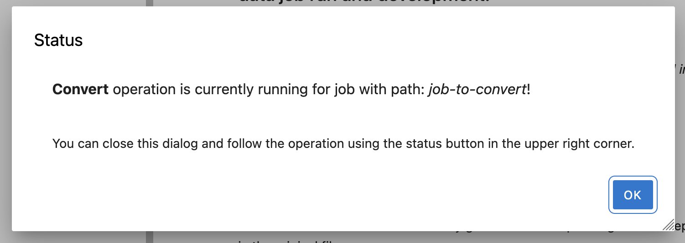

Learn how to convert a VDK Job with .sql and .py steps into a Job with notebook steps using VDK Jupyter Notebook UI.
Time Commitment: About 5-10 minutes.

## Prerequisites
* Installed VDK, Control Service, Jupyter instance, vdk-jupyterlab-extension, vdk-notebook, vdk-ipython
* Created and developed a VDK Data Job

## Data Job Conversion Guide

This guide presumes that you have already initialized a job either locally or in the cloud and have subsequently 
downloaded it to your local file system.

### 0. [Optional] Get Familiar With Your Data Job
- **Navigate to the data job directory.**
- Familiarise yourself with the VDK steps and the file structure of the Data Job

### 1. [Optional] Validate Your Data Job's Functionality
- From the menu bar at the top, locate the `VDK` section and choose the `Run` option.
- Remember the result since after the conversion is completed, the job is expected to return the same result. 

### 2. Locate the 'Convert Job To Notebook' Option
- Select 'Convert Job To Notebook' from the `VDK` section in the menu at the top.

### 3. Specify the Job Directory Path
- After clicking 'Convert Job To Notebook', a dialog will appear requesting the path to the job directory.
- If you are in the data job directory, this will be autofilled, and you can skip this step.
- Otherwise, populate the input with the relative Jupyter path to the job directory, 
following this pattern: `parent/child/job`.
- After filling the requested, click OK to continue.

### 4. Approve the conversion

### 5. Await for an update on operation's status 

### 6. Successful conversion
- After the conversion operation is ready you will get a dialog with an update on operation's result.

### 7. Check the new Data Job structure
- After the conversion operation is ready you will have the .sql and .py steps replaced with a notebook (.ipynb file).
- The file will be Untitled and you can rename it to your liking.

- The notebook will consist of Guide which explains how you Data Job has changed. Get familiar with it.
It will be located on top of the notebook.
- After you familiarise with it, you can optionally delete it.

- Check the new notebook steps.

### 8. [Optional] Validate Your Data Job's Functionality
- From the menu bar at the top, locate the `VDK` section and choose the `Run` option.
- If you have gone through 1. check whether yu get the same result.

## What's next

You should now be familiarized with how to covert a job consisting of .sql and .py steps
into a job consisting of notebook steps through the Jupyter UI.

You can explore the VDK Examples list [here](https://github.com/vmware/versatile-data-kit/wiki/Examples).