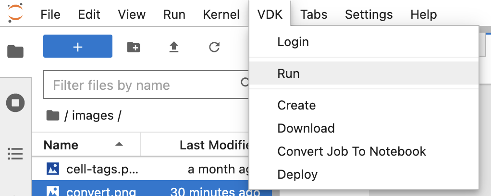
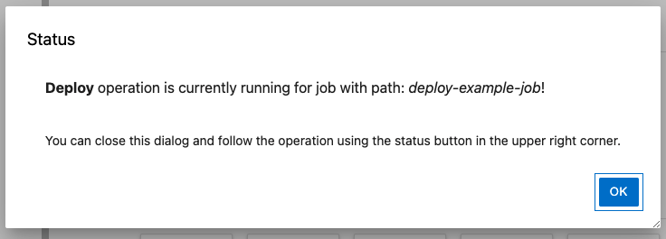
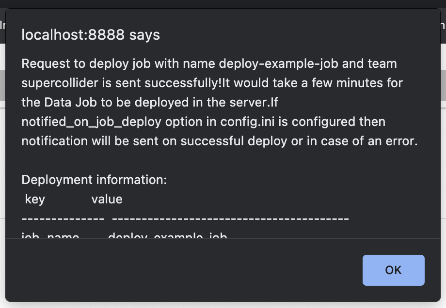

Learn how to prepare and deploy a Data Job using VDK in Jupyter Notebook UI.
Time Commitment: About 5-10 minutes.

## Prerequisites
 * Installed VDK, Control Service, Jupyter instance and Jupyter extension
 * Created and developed a VDK Data Job

## Deploying a job

This page will assume you have already created a job both locally and in the cloud,
and have developed the job.

0. Ensure your Data Job is in a production-ready state. This means tagging all production cells as VDK cells, and untagging any
   you do not want to be ran during the Data Job execution through the side menu shown in the image.

1. Navigate to the data job directory.

2. From the menu bar at the top, open the VDK section and select the 'Deploy' option.

3. Enter your job name, team, and describe the latest change to the job in the
'Deployment reason' section. The path should be configured automatically if
   you have navigated to the job directory. Note the tick box which specifies that
   the job will be ran once before deployment. The purpose of this job execution is
   to test the job end-to-end and verify it can pass successfully before deploying
   it to the cloud.

4. The previous step will generate this status dialog, informing you that the
deploy operation is running. Additionally, you can track the time the operation
   takes by the status button in the upper right corner.

5. The following dialog will appear when the job deployment request has been
successful. Note that the job will require a few minutes to be fully deployed.

## What's next

You should now be familiarized with how to deploy a developed Data Job to the
Control Service through the Jupyter UI.

You can explore the VDK Examples list [here](https://github.com/vmware/versatile-data-kit/wiki/Examples).
